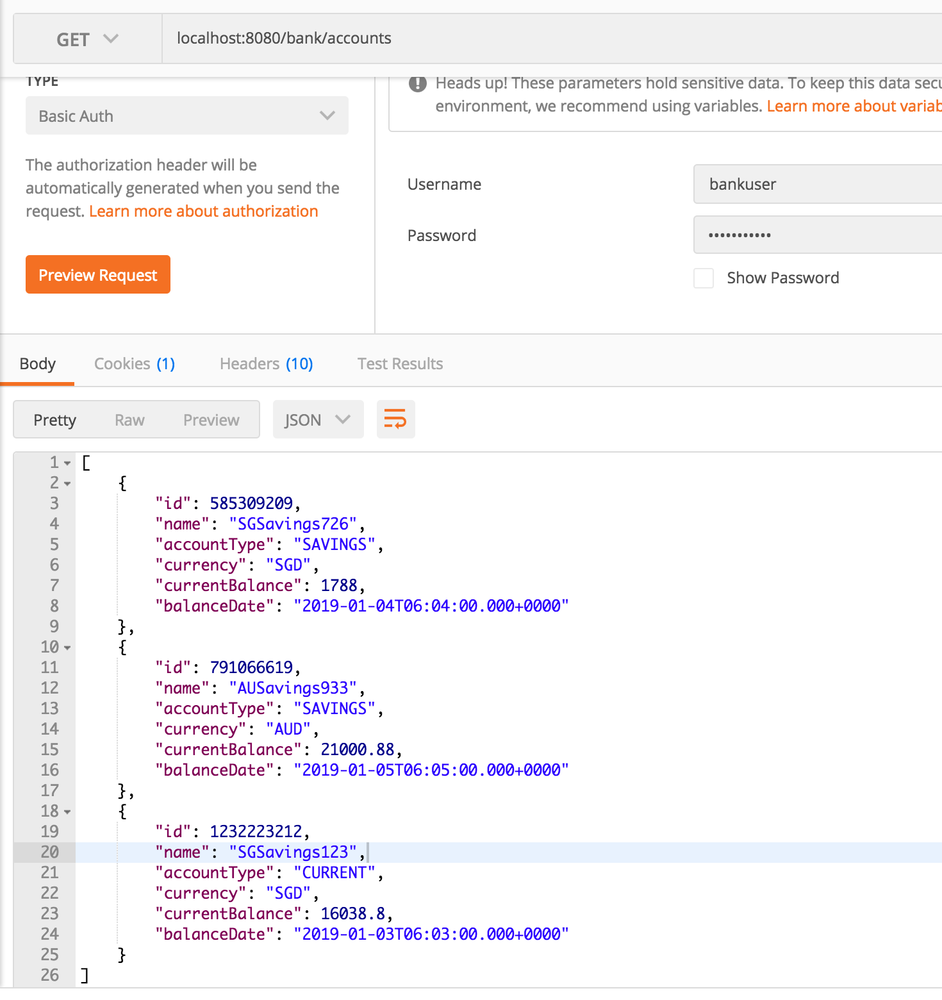
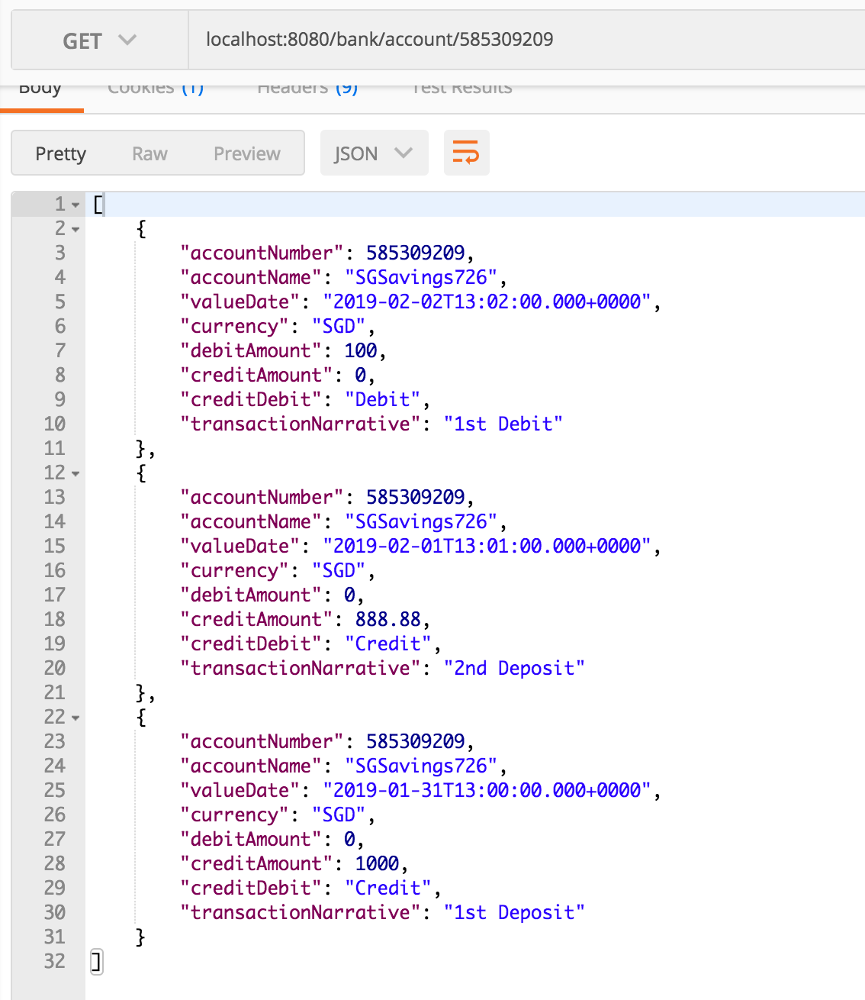

# Bank Application

This sample bank application is the backend service that will support a web application that allows users to view transactions on any of the accounts they hold.

### Prerequisites

What things you need to install the software and how to install them

* JDK 1.8 or later
* Maven 3.5.2 or later
* Git (should be any version. I use v2.14.3)

### Installing

To build and launch the application.

* Clone from 
* Run this maven command from the console 

```
mvn clean install spring-boot:run
```

* Note that the unit test and may take some time to execute as it tests several layers of the application. (e.g. Controller)
* If you have already once the test and ultimately confident about your application, launch it without running the test.

```
mvn clean install spring-boot:run -DskipTests
```

## Features

This application allows bank users to:
* View account list
* View account transactions for a given account id/number
* This implements Basic Auth authentication.

## Limitations
* This app does not include any UI.
* This app does not allow creation of new account and transactions.

## Running the tests

* Either use [Postman](https://www.getpostman.com/downloads/) or any Browser 
* If using Postman, ensure to set the username and password to

```
User: bankuser
Password: bankuser123
```

* If using the browser, it would open a user/password popup during initial query.
* URL

```
Get Accounts: 
http://localhost:8080/bank/accounts

Get Transactions: 
http://localhost:8080/bank/account/585309209
(replace the last numeric value with the account number)

```
* To stop the application, press Ctrl-C

## Sample screenshots

* Get Accounts 


* Get Transactions


## Built With

[Maven](https://maven.apache.org/) - Dependency Management

## Authors

* **Marlon Co** - *Initial work* 


